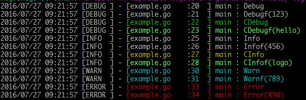

# logo
*logo*는 *go*언어로 작성된 간단한 로깅 라이브러리입니다.

## 설치

    $ go get github.com/truelsy/logo

소스 코드는 아래 위치에 저장.

    $GOPATH/src/github.com/truelsy/logo

패키지 업데이트는 `go get -u` 명령어 수행.


## 사용법

```go
// example.go
package main

import (
	"time"

	"github.com/truelsy/logo"
)

func main() {
	logo.Init(&logo.Environment{
		LogLevel:       logo.LEVEL_DEBUG,
		LogPath:        "/tmp/logo/",
		RotateFileSize: 1024 * 10, // 10K
		LogKeepTime:    time.Hour * 6,
		WriteConsole:   true,
	})
	defer logo.Close()

	logo.Debug("Debug")
	logo.Debugf("Debugf(%v)", 123)
	logo.CDebug(logo.FG_GREEN, "CDebug")
	logo.CDebugf(logo.FG_LIGHT_GREEN, "CDebugf(%v)", "hello")

	logo.Info("Info")
	logo.Infof("Infof(%v)", 456)
	logo.CInfo(logo.FG_YELLOW, "CInfo")
	logo.CInfof(logo.FG_LIGHT_GREEN, "CInfof(%v)", "logo")

	logo.Warn("Warn")
	logo.Warnf("Warnf(%v)", 789)

	logo.Error("Error")
	logo.Errorf("Error(%v)", 890)
}
```
[]
